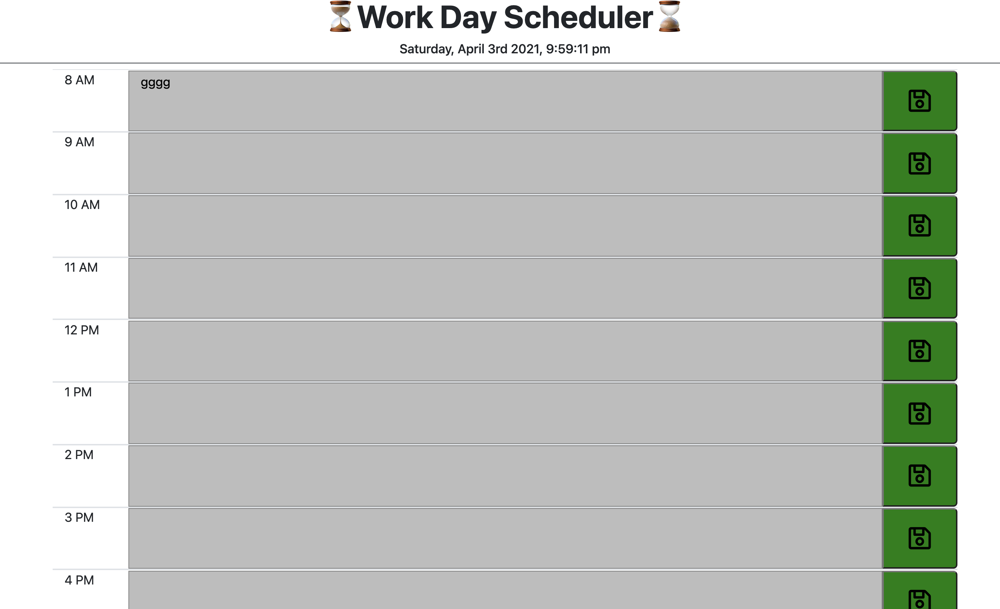

# Work Day Scheduler 

Technologies Used: **HTML5**,  **CSS3**,  **JavaScript**, **MomentJs**

Description:  Calendar application that allows a user to save events for each hour of the day. Display will show green future, red for current hour and grey for past hour. The app will run in the browser and show updated HTML and CSS powered by jQuery.

# view webpage at : [https://lpnrhowell.github.io/Work-Day-Scheduler/](https://lpnrhowell.github.io/Work-Day-Scheduler/)

